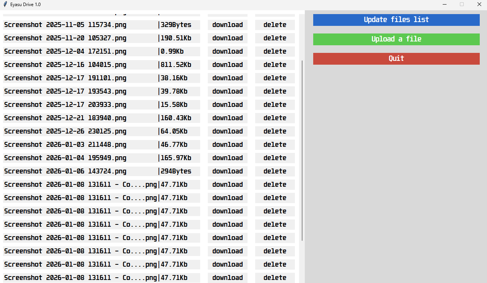

# Ed-tech year 1 first semister project.

Welcome to Eyasu drive, here I have a server and a client written with 100% pure python! the client has gui that I made using tkinter.
You are allowed to upload any file that's less than 16Mb to the server.

Please run the server using an ide and not directly because it keeps saying it's denied accessing it's files.

**Protocols used by the client and the server in this project are found inside protocol.txt**
